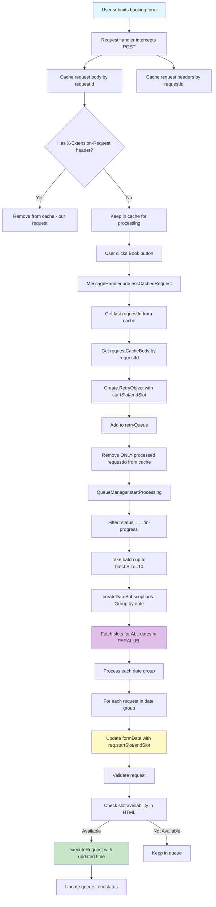

# Bulk Request Processing Flow

## Overview
Система обрабатывает запросы на бронирование слотов пакетно (bulk), группируя их по датам для оптимизации запросов к серверу.

## Architecture Diagram

### Mermaid Flow Diagram



### Text Diagram

```
┌─────────────────────────────────────────────────────────────────────────┐
│                         USER ACTION (Browser)                            │
│  User selects slot and submits booking form                             │
└──────────────────────────────┬──────────────────────────────────────────┘
                                │
                                ▼
┌─────────────────────────────────────────────────────────────────────────┐
│                    RequestHandler (Background)                           │
│  ┌──────────────────────────────────────────────────────────────────┐  │
│  │ 1. Intercept POST to TVApp/EditTvAppSubmit/*                     │  │
│  │    - onBeforeRequest: Cache request body                         │  │
│  │    - onBeforeSendHeaders: Cache headers                          │  │
│  └──────────────────────────────────────────────────────────────────┘  │
│                                │                                         │
│                                ▼                                         │
│  ┌──────────────────────────────────────────────────────────────────┐  │
│  │ 2. Check if request has X-Extension-Request header               │  │
│  │    - YES: Remove from cache (our own request)                    │  │
│  │    - NO:  Keep in cache for processing                          │  │
│  └──────────────────────────────────────────────────────────────────┘  │
└──────────────────────────────┬──────────────────────────────────────────┘
                                │
                                ▼
┌─────────────────────────────────────────────────────────────────────────┐
│                    Storage: requestCacheBody                             │
│  {                                                                       │
│    "requestId-1": { url, body, timestamp },                            │
│    "requestId-2": { url, body, timestamp },                            │
│    ...                                                                   │
│  }                                                                       │
└──────────────────────────────┬──────────────────────────────────────────┘
                                │
                                ▼
┌─────────────────────────────────────────────────────────────────────────┐
│                  MessageHandler (Background)                             │
│  ┌──────────────────────────────────────────────────────────────────┐  │
│  │ 3. User clicks "Book" button → SHOW_ERROR/SUCCEED_BOOKING        │  │
│  │    - Get last requestId from cache                               │  │
│  │    - Get requestCacheBody by requestId                            │  │
│  │    - Create RetryObject with:                                     │  │
│  │      * startSlot from formData.SlotStart[0]                       │  │
│  │      * endSlot from formData.SlotEnd[0]                           │  │
│  │      * body, headers, tvAppId, etc.                               │  │
│  │    - Add to queue                                                │  │
│  │    - Remove ONLY processed requestId from cache                  │  │
│  └──────────────────────────────────────────────────────────────────┘  │
└──────────────────────────────┬──────────────────────────────────────────┘
                                │
                                ▼
┌─────────────────────────────────────────────────────────────────────────┐
│                    Storage: retryQueue                                  │
│  [                                                                      │
│    { id, tvAppId, startSlot, endSlot, body, status: "in-progress" },   │
│    { id, tvAppId, startSlot, endSlot, body, status: "in-progress" },  │
│    ...                                                                  │
│  ]                                                                      │
└──────────────────────────────┬──────────────────────────────────────────┘
                                │
                                ▼
┌─────────────────────────────────────────────────────────────────────────┐
│              QueueManager.startProcessing()                              │
│  ┌──────────────────────────────────────────────────────────────────┐  │
│  │ 4. Process queue in intervals (intervalMin - intervalMax)        │  │
│  │    - Filter: status === "in-progress"                            │  │
│  │    - Take batch (batchSize = 10)                                 │  │
│  └──────────────────────────────────────────────────────────────────┘  │
│                                │                                         │
│                                ▼                                         │
│  ┌──────────────────────────────────────────────────────────────────┐  │
│  │ 5. createDateSubscriptions(batch)                                │  │
│  │    ┌──────────────────────────────────────────────────────────┐  │  │
│  │    │ For each request:                                         │  │  │
│  │    │   - Extract date from req.startSlot (if available)        │  │  │
│  │    │   - OR from req.body.formData.SlotStart[0]                │  │  │
│  │    │   - Group by date: Map<date, RetryObject[]>               │  │  │
│  │    └──────────────────────────────────────────────────────────┘  │  │
│  │    Result:                                                         │  │
│  │    {                                                               │  │
│  │      "14.01.2026": [req1, req2, req3],                           │  │
│  │      "15.01.2026": [req4, req5],                                 │  │
│  │      "16.01.2026": [req6]                                        │  │
│  │    }                                                               │  │
│  └──────────────────────────────────────────────────────────────────┘  │
│                                │                                         │
│                                ▼                                         │
│  ┌──────────────────────────────────────────────────────────────────┐  │
│  │ 6. Fetch slots for ALL dates in PARALLEL                         │  │
│  │    Promise.allSettled([                                          │  │
│  │      getSlots("14.01.2026"),  // ─┐                              │  │
│  │      getSlots("15.01.2026"),  //  ├─ Parallel                    │  │
│  │      getSlots("16.01.2026"),  // ─┘                              │  │
│  │    ])                                                             │  │
│  └──────────────────────────────────────────────────────────────────┘  │
│                                │                                         │
│                                ▼                                         │
│  ┌──────────────────────────────────────────────────────────────────┐  │
│  │ 7. Process each date group                                       │  │
│  │    For each date:                                                │  │
│  │    ┌──────────────────────────────────────────────────────────┐  │  │
│  │    │ processDateGroup(date, requests, slots, queue)           │  │  │
│  │    │                                                           │  │  │
│  │    │ For each request in date group:                           │  │  │
│  │    │   1. Update formData with req.startSlot/req.endSlot       │  │  │
│  │    │      (if available) - FIXES TIME MISMATCH                 │  │  │
│  │    │   2. Validate request (expired, paused, etc.)             │  │  │
│  │    │   3. Check slot availability in HTML                       │  │  │
│  │    │   4. If available: executeRequest()                      │  │  │
│  │    │   5. Update queue item status                             │  │  │
│  │    └──────────────────────────────────────────────────────────┘  │  │
│  └──────────────────────────────────────────────────────────────────┘  │
└──────────────────────────────┬──────────────────────────────────────────┘
                                │
                                ▼
┌─────────────────────────────────────────────────────────────────────────┐
│                    executeRequest()                                      │
│  ┌──────────────────────────────────────────────────────────────────┐  │
│  │ 8. Before sending:                                                │  │
│  │    - Update req.body.formData.SlotStart = [req.startSlot]       │  │
│  │    - Update req.body.formData.SlotEnd = [req.endSlot]            │  │
│  │    - Create FormData from updated formData                       │  │
│  │    - Send POST request                                            │  │
│  │    - Handle response (success/error)                              │  │
│  └──────────────────────────────────────────────────────────────────┘  │
└─────────────────────────────────────────────────────────────────────────┘
```

## Key Components

### 1. Request Caching (RequestHandler)
- **Purpose**: Intercept and cache user booking requests
- **When**: Before request is sent to server
- **What**: Body and headers stored separately by `requestId`
- **Cleanup**: Removed when processed or if it's our own request

### 2. Queue Management (QueueManager)
- **Batch Processing**: Processes up to 10 requests at a time (batchSize)
- **Date Grouping**: Groups requests by date to minimize API calls
- **Parallel Fetching**: Fetches slots for all dates simultaneously
- **Sequential Processing**: Processes requests within each date group sequentially

### 3. Time Synchronization Fix
- **Problem**: Cached time might not match searched time
- **Solution**: 
  - Use `req.startSlot` and `req.endSlot` (the time we're actually searching for)
  - Update `req.body.formData` before sending request
  - Ensures correct time is sent to server

## Flow Sequence

```
1. User submits form
   ↓
2. RequestHandler caches body + headers
   ↓
3. User clicks "Book" → MessageHandler processes cache
   ↓
4. RetryObject created and added to queue
   ↓
5. QueueManager processes batch:
   ├─ Group by date
   ├─ Fetch slots in parallel
   └─ Process each date group
      ├─ Update formData with correct time
      ├─ Validate request
      ├─ Check slot availability
      └─ Execute request if available
```

## Cache Management

### Old Approach (Problem)
- `cleanupCache()` cleared ALL cached requests
- If multiple requests cached, only one processed, others lost
- Cache not cleaned on errors

### New Approach (Fixed)
- `removeCachedRequest(requestId)` removes only processed request
- Other requests remain in cache for next processing cycle
- Cache cleaned even on errors
- Better logging of cache state

## Parallel Processing Visualization

```
Time →
│
├─ [Batch of 10 requests]
│  ├─ Request 1: 14.01.2026 22:00
│  ├─ Request 2: 14.01.2026 23:00
│  ├─ Request 3: 15.01.2026 02:00
│  ├─ Request 4: 15.01.2026 03:00
│  └─ ...
│
├─ [Group by Date]
│  ├─ Date: 14.01.2026 → [Req1, Req2]
│  └─ Date: 15.01.2026 → [Req3, Req4]
│
├─ [Parallel Slot Fetching] ⚡
│  ├─ getSlots("14.01.2026") ─┐
│  └─ getSlots("15.01.2026") ─┼─ All execute simultaneously
│                              ┘
├─ [Sequential Processing per Date]
│  ├─ Date: 14.01.2026
│  │  ├─ Process Req1 → Update time → Validate → Check → Execute
│  │  └─ Process Req2 → Update time → Validate → Check → Execute
│  └─ Date: 15.01.2026
│     ├─ Process Req3 → Update time → Validate → Check → Execute
│     └─ Process Req4 → Update time → Validate → Check → Execute
│
└─ [Results]
   ├─ Req1: ✅ Success
   ├─ Req2: ⏸️ Paused (too many transactions)
   ├─ Req3: ❌ Slot not available
   └─ Req4: ✅ Success
```

## Bulk Processing Benefits

1. **Efficiency**: One API call per date instead of per request
   - 10 requests for 3 dates = 3 API calls (not 10)
   
2. **Performance**: Parallel fetching of slots for different dates
   - All date requests execute simultaneously
   - Reduces total processing time
   
3. **Reliability**: Failed requests don't block others
   - Each request processed independently
   - Errors handled per request
   
4. **Scalability**: Batch processing prevents overload
   - Limits concurrent requests (batchSize = 10)
   - Prevents server overload

## Configuration

- `batchSize`: 10 (max requests per batch)
- `intervalMin/Max`: Random interval between processing cycles
- Processing only `in-progress` status requests

## Example Data Flow

### Step 1: Caching
```javascript
// User submits 3 booking requests
requestCacheBody = {
  "req-001": {
    url: "https://ebrama.baltichub.com/TVApp/EditTvAppSubmit/",
    body: { formData: { SlotStart: ["14.01.2026 22:00:00"], ... } },
    timestamp: 1705276800000
  },
  "req-002": {
    url: "https://ebrama.baltichub.com/TVApp/EditTvAppSubmit/",
    body: { formData: { SlotStart: ["15.01.2026 02:00:00"], ... } },
    timestamp: 1705276801000
  },
  "req-003": {
    url: "https://ebrama.baltichub.com/TVApp/EditTvAppSubmit/",
    body: { formData: { SlotStart: ["14.01.2026 23:00:00"], ... } },
    timestamp: 1705276802000
  }
}
```

### Step 2: Queue Creation
```javascript
// After processing cache, queue contains:
retryQueue = [
  {
    id: "uuid-1",
    tvAppId: "92008767",
    startSlot: "14.01.2026 22:00:00",  // From formData.SlotStart[0]
    endSlot: "14.01.2026 22:59:00",
    body: { formData: { SlotStart: ["14.01.2026 22:00:00"], ... } },
    status: "in-progress"
  },
  {
    id: "uuid-2",
    tvAppId: "92008768",
    startSlot: "15.01.2026 02:00:00",
    endSlot: "15.01.2026 02:59:00",
    body: { formData: { SlotStart: ["15.01.2026 02:00:00"], ... } },
    status: "in-progress"
  },
  {
    id: "uuid-3",
    tvAppId: "92008769",
    startSlot: "14.01.2026 23:00:00",
    endSlot: "14.01.2026 23:59:00",
    body: { formData: { SlotStart: ["14.01.2026 23:00:00"], ... } },
    status: "in-progress"
  }
]
```

### Step 3: Date Grouping
```javascript
// createDateSubscriptions groups by date:
subscriptions = new Map([
  ["14.01.2026", [req1, req3]],  // 2 requests for same date
  ["15.01.2026", [req2]]          // 1 request
])
```

### Step 4: Parallel Slot Fetching
```javascript
// Fetch slots for all dates simultaneously:
Promise.allSettled([
  getSlots("14.01.2026"),  // Returns HTML with available slots
  getSlots("15.01.2026")   // Returns HTML with available slots
])
```

### Step 5: Time Update (FIX)
```javascript
// Before sending request, update formData:
// OLD (WRONG): Uses cached time
req.body.formData.SlotStart = ["15.01.2026 02:00:00"]  // From cache

// NEW (CORRECT): Uses req.startSlot (the time we're searching for)
req.body.formData.SlotStart = [req.startSlot]  // "14.01.2026 22:00:00"
req.body.formData.SlotEnd = [req.endSlot]     // "14.01.2026 22:59:00"
```

## Critical Fix: Time Synchronization

### Problem
- User searches for slot at `14.01.2026 22:00:00`
- But cached request has `15.01.2026 02:00:00`
- System sends request with wrong time → booking fails

### Solution
1. Store `startSlot` and `endSlot` in RetryObject (from formData when creating)
2. Before sending request, update `req.body.formData` with `req.startSlot/endSlot`
3. Ensures correct time is sent to server

### Code Flow
```typescript
// In processDateGroup:
if (req.startSlot && req.body?.formData) {
    req.body.formData.SlotStart = [req.startSlot];  // Update!
    req.body.formData.SlotEnd = [req.endSlot];      // Update!
    time = req.startSlot.split(' ');
}

// In executeRequest:
if (req.startSlot && req.endSlot) {
    req.body.formData.SlotStart = [req.startSlot];  // Update again!
    req.body.formData.SlotEnd = [req.endSlot];      // Update again!
}
```

## Cache Cleanup Strategy

### Old Approach (Problem)
```javascript
// After processing ONE request:
cleanupCache()  // ❌ Deletes ALL cached requests
// Result: Other requests lost from cache
```

### New Approach (Fixed)
```javascript
// After processing ONE request:
removeCachedRequest(requestId)  // ✅ Deletes ONLY processed request
// Result: Other requests remain for next cycle

// Example:
// Before: { "req-001": {...}, "req-002": {...}, "req-003": {...} }
// Process req-001
// After:  { "req-002": {...}, "req-003": {...} }  // Only req-001 removed
```
