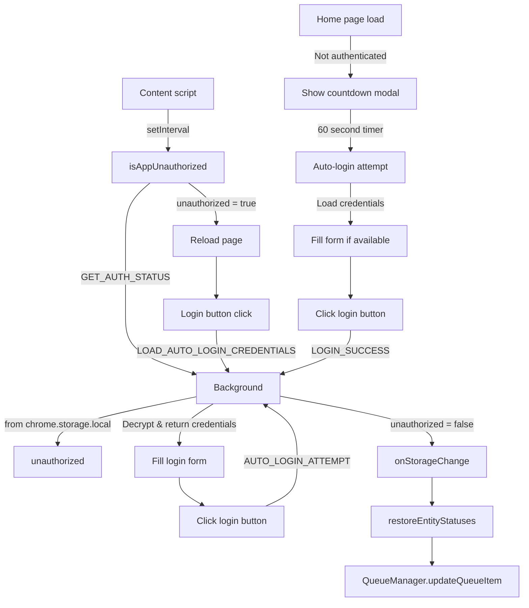

# Auto-Login Feature Overview

This feature enables the Chrome extension to automatically recover from an expired session by triggering a login on the content page. Once logged in, it restores background processing of previously failed requests due to authorization errors.

## Components Involved

### 1. Content Script

Periodically (every 1 minute) calls `isAppUnauthorized()` by sending a message to the background.

If unauthorized, triggers `window.location.reload()` to redirect to the login page.

**New: Countdown Modal on Home Page**
- On the home page (`/`), if user is not authenticated, shows a countdown modal
- Modal displays 60-second countdown before automatic login button click
- User can click "Zaloguj teraz" immediately or wait for countdown to complete
- Simply clicks the login button on the home page (no auto-login form filling)

After reload, attempts to simulate a login by clicking the login button.

Upon successful login, sends a message (`LOGIN_SUCCESS` or `AUTO_LOGIN_ATTEMPT`) back to the background.

### 2. Background Script

Maintains a `unauthorized` flag in `chrome.storage.local`.

Responds to `GET_AUTH_STATUS` requests with the current authorization state.

Listens for `LOGIN_SUCCESS` and `AUTO_LOGIN_ATTEMPT`, and resets the `unauthorized` flag.

Listens for `chrome.storage.onChanged` for `unauthorized` updates.

If changed to `false`, triggers `restoreEntityStatuses()`.

Handles `LOAD_AUTO_LOGIN_CREDENTIALS` requests by decrypting and returning stored credentials.

### 3. QueueManager

Manages a retry queue stored in `chrome.storage.local`.

Has a method `updateQueueItem` to change status of queued requests.

The `restoreEntityStatuses()` function scans the queue and changes entities with status `authorization-error` back to `in-progress`.

### 4. Auto-Login Service

Manages user credentials with encryption/decryption functionality.

Provides methods for saving, loading, and clearing auto-login credentials.

Handles credential encryption using simple XOR encryption (demo implementation).

### 5. Popup UI

Provides a compact auto-login toggle button in the user actions section.

Opens a modal dialog for managing auto-login credentials with:
- Login field (text input)
- Password field (password input)
- Info note: "Your credentials are stored locally and used only for automatic login."
- Save, Clear, and Cancel buttons

All UI text is in Polish language.

### 6. Countdown Modal

**New Component: `src/content/modals/countdownModal.ts`**

Shows a modal dialog on the home page with:
- Title: "Automatyczne logowanie"
- Countdown timer showing seconds remaining (60 seconds)
- "Zaloguj teraz" button for immediate action
- "Anuluj" button to cancel
- 60-second automatic countdown

**Simple Implementation:**
- Only clicks the login button on the home page (`a.product-box[href="/login"]`)
- No auto-login form filling (unlike login page)
- No credential loading or form manipulation
- Just navigates to login page after countdown

## Storage Keys

| Key | Scope | Description |
|-----|-------|-------------|
| `unauthorized` | local | Boolean flag indicating if user is authenticated |
| `retryQueue` | local | Array of entities to be retried |
| `autoLoginData` | local | Encrypted auto-login credentials with enabled flag |

## Sequence of Events (Detailed)

### Home Page Flow (New)
1. **User visits home page** → content script checks authentication
2. **If not authenticated** → shows countdown modal
3. **Countdown modal** → 60-second timer with simple login button click
4. **Login button click** → navigates to login page
5. **On login page** → existing auto-login logic applies

### Login Page Flow (Existing)
1. **Request to backend fails** → background sets `unauthorized = true`
2. **Content script detects unauthorized** → triggers page reload
3. **On login page** → script attempts auto-login:
   - Requests credentials from background (`LOAD_AUTO_LOGIN_CREDENTIALS`)
   - Background decrypts and returns credentials
   - Content script fills login form with credentials
   - Clicks login button
4. **On success** → script sends `AUTO_LOGIN_ATTEMPT` event → background sets `unauthorized = false`
5. **Background reacts** → updates entity statuses in retry queue

## Auto-Login Flow

## Security Notes

- Credentials are stored locally with simple XOR encryption (demo implementation)
- In production, a more secure encryption method should be used
- Credentials are only used for automatic login and never transmitted to external servers
- Users can clear stored credentials at any time through the popup UI
- Countdown modal provides user control over automatic navigation to login page
